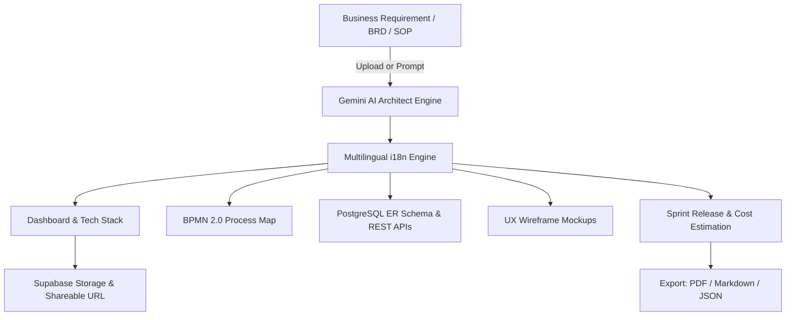

# 🚀 Futurrizon Business Transformation AI (AI Solution Builder)

> **Enterprise AI-Powered Solution Architecture & Implementation Blueprint Generator**  
> Built with Next.js 16, TypeScript, Tailwind CSS, Google Gemini AI 1.5/2.0, and Supabase.

---

## 🌟 Overview & Key Features

**Business Transformation AI** is a state-of-the-art enterprise solution architect workspace. It converts business problem statements, user requirements, BRDs, and SOP documents into production-grade architectural blueprints across 5 visual modules.



### ✨ Core Capabilities Matrix

| Feature Module | Description | Technical Implementation |
| :--- | :--- | :--- |
| **📄 Document Upload Engine** | Parse BRD, SOP, PDF, DOCX, TXT, MD files via Drag-and-Drop | Client-side FileReader & Gemini System Context |
| **📥 Report Export Engine** | Export full blueprint as PDF Report, Markdown (`.md`), or JSON (`.json`) | Print CSS, Blob URL Generators & Native PDF export |
| **🌐 Multilingual Support (i18n)** | Generate architecture in English, Gujarati, Hindi, Spanish, French, German | Dynamic System Prompt Translation Layer |
| **💰 Financial & Resource Planning** | Est. Financial Budget ($ range), hourly rate ($75/hr), team role allocation, Sprint 1-6 release roadmap | Dynamic Cost Calculation Engine & Agile Milestone Planner |
| **👥 Save & Share Blueprint** | Save blueprints to Supabase PostgreSQL with versioning & shareable URLs | `@supabase/supabase-js` + LocalStorage Fallback |
| **🔐 Admin Control Panel (`/admin`)** | AI Model Switcher (`Gemini 1.5 Flash`, `1.5 Pro`, `Mock`), API latency metrics, RBAC permissions | Next.js App Router Page (`/admin`) |

---

## 🛠️ Tech Stack

- **Frontend Framework**: Next.js 16 (App Router) + React 19 + TypeScript
- **Styling**: Tailwind CSS + Lucide Icons + Shadcn UI primitives
- **AI Intelligence**: Google Gemini API (`@google/generative-ai` / `gemini-1.5-flash` / `gemini-1.5-pro`)
- **Backend & Database**: Node.js Serverless API Gateway + Supabase PostgreSQL (`@supabase/supabase-js`)
- **State & Storage**: React Hooks + LocalStorage + URL Search Parameters

---

## 🚀 Quick Start & Local Setup

### 1. Prerequisites
- Node.js 18.x or higher
- npm / pnpm / yarn

### 2. Installation
```bash
# Clone repository
git clone https://github.com/jaypatel1907/Business-Transformation-AI.git
cd Business-Transformation-AI

# Install dependencies
npm install
```

### 3. Environment Variables Setup
Create a `.env.local` file in the project root:
```env
NEXT_PUBLIC_SUPABASE_URL=https://your-supabase-project.supabase.co
NEXT_PUBLIC_SUPABASE_ANON_KEY=your-supabase-anon-key
GEMINI_API_KEY=your-google-gemini-api-key
```

### 4. Run Development Server
```bash
npm run dev
```
Open [http://localhost:3000](http://localhost:3000) in your browser.  
Visit [http://localhost:3000/admin](http://localhost:3000/admin) to open the Admin Panel.

---

## 🌐 Vercel Deployment Instructions

1. Push code to your GitHub repository.
2. Import project into Vercel Dashboard.
3. Configure Environment Variables (`GEMINI_API_KEY`, `NEXT_PUBLIC_SUPABASE_URL`, `NEXT_PUBLIC_SUPABASE_ANON_KEY`).
4. Click **Deploy**.

---

## 📄 License & Attribution

Developed for **Futurrizon Technologies**. All Rights Reserved.